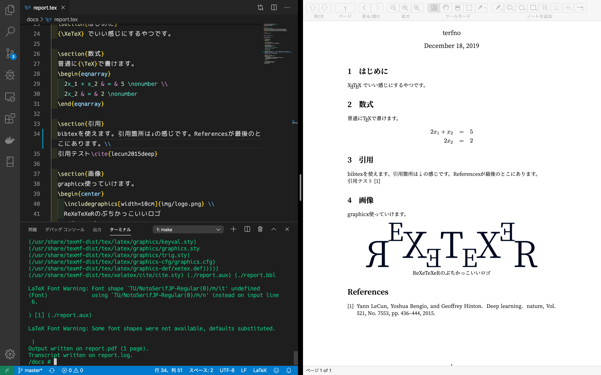

# ReXeTeXeR

<div style="text-align:center;">

  

</div>

ぼくのブログ: [TeX の環境構築ダルくね…? せや!](https://medium.com/@terfno/b9892d0d343c?)


<div style="text-align:center;">マジでかっこいいロゴっぽいやつ</div><br>

## これはなに



<div style="text-align:center;">動作イメージ(スクショは開発中のもの)</div><br>

日本語の `.tex` (UTF-8) を TeX の環境構築なしに、XeTeX(xelatex)を使って `.pdf` に変換する Docker のコンテナーを作れるファイル群です。勝手に**ReXeTeXeR**と名前をつけました。pBibTeX による Reference の自動生成に対応してます。

# ReXeTeXeR

<div style="text-align:center;">

  

</div>

## 環境

Docker は必須です。それ以外はオプショナルです。

- Docker(必須)
- GNU Make
- テキストエディタ
- 自動リロードできる PDF ビュワー

## 使い方

### 0. 準備

download したこのリポジトリを作業したい場所で展開します。すると、以下のようになるはずです。

```
.
├── LICENSE
├── Makefile
├── README.md
├── img
│   └── logo.png
├── ref.bib
├── report.pdf
├── report.tex
└── watch.sh
```

その後、以下のコマンドで ReXeTeXeR を pull します。

```sh
$ make init
```

これで ReXeTeXeR が pull されます。

### 1. 起動

```sh
$ make run
```

### 2. 接続

```sh
$ make exec
```

これでコンテナに入れます。以降のコマンドは特に記載がなければコンテナ内で実行するコマンドです。

### 3. 自動コンパイルスクリプトを起動

```sh
$ make watch
```

### 4. TeX を書く

`./report.tex`を編集することで、PDF が錬成されます。
XeTeX(XeLaTeX)です。

#### 画像の表示

`./img`以下に画像ファイルを置きます。その後 tex ファイルに以下のような記述をすると画像を表示できます。
プリアンブルで graphicx の使用を追記します。

```tex
\usepackage{graphicx}
```

document 内で以下のように書くと画像を表示できます。

```tex
\includegraphics[width=10cm]{./img/logo.png}
```

詳細は`report.tex`を読むか、graphicx package について調べてください。

#### 引用(BibTeX)

プリアンブルに cite の使用を追記します。

```tex
% bibtex
\usepackage{cite}
```

そして`ref.bib`に引用の情報を書きます。

```bib
@article{lecun2015deep,
  title={Deep learning},
  author={LeCun, Yann and Bengio, Yoshua and Hinton, Geoffrey},
  journal={nature},
  volume={521},
  number={7553},
  pages={436--444},
  year={2015},
  publisher={Nature Publishing Group}
}
```

document 内で以下のように書くと引用できます。

```tex
\cite{lecun2015deep}
```

### 5. PDF を見る

リソースのオートリロードに対応した PDF ビューワーを使って`report.pdf`を開くと、ほぼリアルタイムにプレビューされます。

### 6. その他

#### 1 回だけコンパイルしたい

コンテナ内で以下のコマンドを実行すると、`reoprt.tex`から`report.pdf`に変換されます。

```sh
$ make tex
```

#### VSCode の Auto Save との相性が悪い

ファイルの変更を察知してコンパイルが走るので、VSCode などの Auto Save で文法が完成していない tex ファイルがコンパイルされることがあります。
`.vscode`を残すことでこの ReXeTeXeR があるワークスペースのみ`onFocusChange`になります。

#### 自動リロードに対応した PDF ビューワー

- 自動リロードに対応した PDF ビューワー
  - macOS: [Skim](https://skim-app.sourceforge.io/)
  - windows10: [Sumatra PDF](https://www.sumatrapdfreader.org/)
  - Linux: [Evince](https://wiki.gnome.org/Apps/Evince)

#### 止めるときは

コンテナから出て(`$ exit`)、以下のコマンドで止められます。

```sh
$ make stop
```

## 古事記

// もしこの ReXeTeXeR が役に立ったらなんか贈ってもらえると私の励みになります。

- [my Amazon wish list of books](https://www.amazon.co.jp/hz/wishlist/ls/3F249ZYIVVASC/ref=nav_wishlist_lists_2?_encoding=UTF8&type=wishlist)
- [my Amazon wish list of gadget](https://www.amazon.co.jp/hz/wishlist/ls/21AZUN2VWHY3C/ref=nav_wishlist_lists_3?_encoding=UTF8&type=wishlist)
- [my Amazon wish list(tea, game, etc)](https://www.amazon.co.jp/hz/wishlist/ls/27B0W5F7BN0VF/ref=nav_wishlist_lists_4?_encoding=UTF8&type=wishlist)

## ディレクトリ

### `/design`について

ReXeTeXeR のロゴの ai ファイルと png があります。

### `/docs`について

開発中にマウントしているディレクトリです。

- `Makefile`
  - 監視とか変換のコマンドをまとめています
- `watch.sh`
  - 監視 → コマンド実行のシェルスクリプトです
- `report.tex`
  - 監視されている tex ファイルです
  - この tex ファイルを編集します
- `ref.bib`
  - BibTeX のリストです
- `report.pdf`
  - 吐き出された PDF です
- その他諸々
  - 変換時に出てきます
  - `.aux`に関しては bibtex が読みます

### `/font`について

Google Fonts からいくつか用意しました。コンテナ内に自動的に配置されます。不要であれば Dockerfile を編集してください。

- Courier Prime (R,I,B)
- Noto Sans JP (R,B)
- Noto Serif JP (R,B)

### `/src`について

Reference を表示するのに必要だった`cite.sty`と`junsrt.bst`が置いてあります。今後必要なライブラリがあれば、ここを使用してコンテナー内に配置する予定です。

- cite.sty: mirrors.ctan.org/macros/latex/contrib/cite/cite.sty
- junsrt.bst: http://mirror.las.iastate.edu/tex-archive/biblio/pbibtex/base/junsrt.bst
